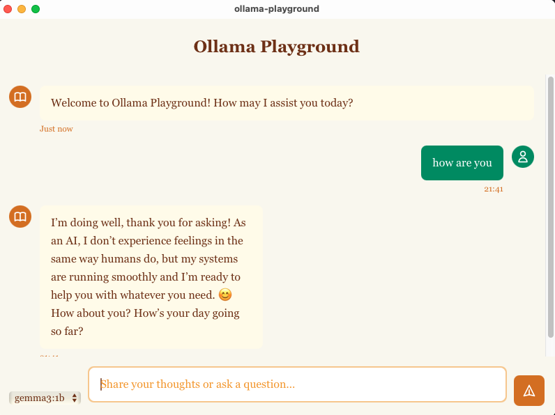

# Ollama Playground

A beautiful desktop application for interacting with Ollama language models, built with Tauri (Rust + Web technologies). Experience a book-like, elegant chat interface for your local AI models.



## 🌟 Key Features

### 🎨 **Elegant User Interface**
- **Book-inspired design** with warm amber/brown color scheme
- **Responsive chat interface** with smooth animations
- **Real-time streaming responses** for natural conversation flow
- **Auto-resizing text input** that adapts to your message length

### 🤖 **Ollama Integration**
- **Model selection dropdown** to choose from your installed Ollama models
- **Direct communication** with local Ollama instance
- **Streaming chat responses** for immediate feedback
- **Full conversation history** maintained during session

### ⚡ **Performance & Technology**
- **Native desktop performance** powered by Tauri framework
- **Rust backend** for efficient Ollama API communication
- **Modern web frontend** with Tailwind CSS styling
- **Cross-platform compatibility** (Windows, macOS, Linux)

### 💬 **Chat Features**
- **Real-time message streaming** with visual feedback
- **Timestamped messages** for conversation tracking
- **User and assistant message differentiation** with distinct styling
- **Enter to send, Shift+Enter for new lines** for intuitive input
- **Automatic scrolling** to latest messages

## 🚀 Getting Started

### Prerequisites

1. **Ollama Installation**
   ```bash
   # Install Ollama from https://ollama.ai
   # Then pull at least one model:
   ollama pull gemma3.1b
   # or
   ollama pull llama3.1
   ```

2. **Development Environment**
   - [Rust](https://rustup.rs/) (latest stable)
   - [Node.js](https://nodejs.org/) (v16 or later)
   - [pnpm](https://pnpm.io/) package manager

### Installation & Running

1. **Clone the repository**
   ```bash
   git clone git@github.com:theArjun/ollama-playground.git
   cd ollama-playground
   ```

2. **Start Ollama service**
   ```bash
   # Make sure Ollama is running
   ollama serve
   ```

3. **Run the application**
   
   For development:
   ```bash
   pnpm tauri dev
   ```
   
   To build for production:
   ```bash
   pnpm tauri build
   ```

### First Time Setup

1. **Ensure Ollama is running** with `ollama serve`
2. **Verify you have models installed** with `ollama list`
3. **Launch the application** - it will automatically detect your available models
4. **Select a model** from the dropdown and start chatting!

## 🛠️ Development

### Project Structure
```
ollama-playground/
├── src/                    # Frontend (HTML, CSS, JS)
│   ├── index.html         # Main UI layout
│   ├── main.js           # Frontend logic & Tauri integration
│   └── assets/           # Static assets
├── src-tauri/            # Rust backend
│   ├── src/
│   │   ├── lib.rs        # Main Tauri application & Ollama integration
│   │   └── main.rs       # Entry point
│   ├── Cargo.toml        # Rust dependencies
│   └── tauri.conf.json   # Tauri configuration
└── package.json          # Node.js dependencies & scripts
```

### Key Technologies
- **Backend**: Rust with Tauri framework
- **Frontend**: Vanilla JavaScript with Tailwind CSS
- **AI Integration**: Ollama-rs crate for Rust
- **Styling**: Tailwind CSS with custom book-inspired theme
- **Build Tool**: Tauri CLI with pnpm

## 🔧 Troubleshooting

### Common Issues

**"No models found" error:**
- Ensure Ollama is running: `ollama serve`
- Verify models are installed: `ollama list`
- Check Ollama is accessible on default port (11434)

**Application won't start:**
- Verify Rust is installed: `rustc --version`
- Check Node.js version: `node --version` (should be v16+)
- Reinstall dependencies: `pnpm install`

**Chat not working:**
- Confirm Ollama service is running
- Check if the selected model is available
- Restart the application if models were added after launch

## 📝 Usage Tips

- **Model Selection**: Choose different models from the dropdown for varied conversation styles
- **Message Input**: Use Enter to send, Shift+Enter for multi-line messages
- **Conversation Flow**: Messages stream in real-time for natural conversation experience
- **Performance**: Larger models may take longer to respond depending on your hardware

## 🤝 Contributing

1. Fork the repository
2. Create a feature branch
3. Make your changes
4. Test thoroughly
5. Submit a pull request

## 📄 License

This project is open source. Please check the license file for details.
